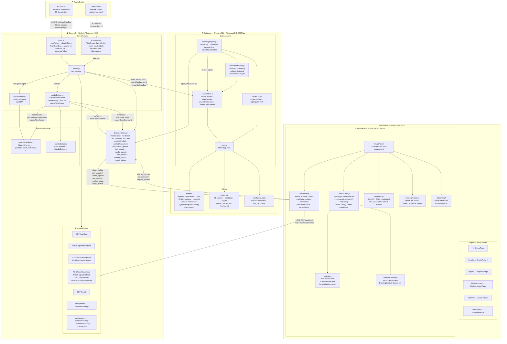
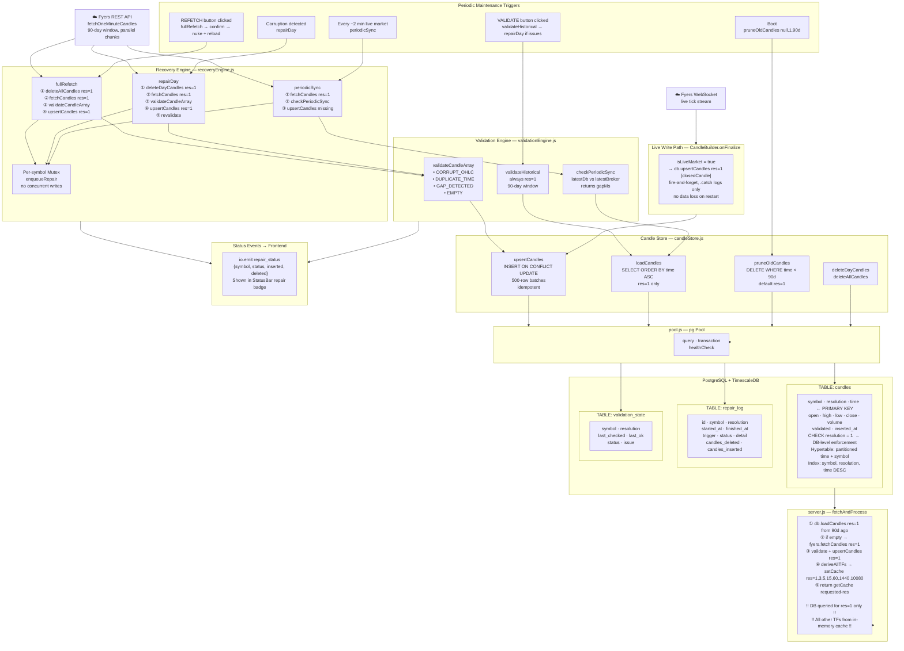

# TGG — Architecture & Wiring Map
**Date:** 2026-06-03  
**Purpose:** Complete connection map of every file, function, route, socket event, and data flow in the codebase.

---

## Project-Level Architecture Diagram



---

## Database Architecture Diagram



---

## Project-Level Architecture Diagram

```
╔══════════════════════════════════════════════════════════════════════════════════╗
║                         TGG TRADING PLATFORM — FULL STACK                        ║
╚══════════════════════════════════════════════════════════════════════════════════╝

  ┌─────────────────────────────────────────────────────────────────────────────┐
  │  BROWSER  (React SPA — localhost:3000)                                       │
  │                                                                              │
  │  App.js — Router                                                             │
  │  ├── /              HomePage.js                                              │
  │  ├── /charts        ChartsPage.js  ◄── main trading view                     │
  │  ├── /reports       ReportsPage.js                                           │
  │  ├── /fib-dashboard FibDashboardPage.js                                      │
  │  ├── /scanner       ScannerPage.js                                           │
  │  └── /strategies    StrategiesPage.js                                        │
  │                                                                              │
  │  ChartsPage layout: 1 / 2h / 2v / 3 / 4 panels                              │
  │  Each panel = independent ChartPanel component                               │
  │                                                                              │
  │  ChartPanel                                                                  │
  │  ├── useSocket()          hooks/useSocket.js                                 │
  │  │     ├── socket.io-client  ◄──────────────────────── WS :9003             │
  │  │     └── axios REST        ──────────────────────────► HTTP :9003         │
  │  ├── CandleChart.js       lightweight-charts canvas                         │
  │  │     ├── WavesIndicator.js                                                 │
  │  │     ├── SRZonesIndicator.js                                               │
  │  │     ├── ConsolidationIndicator.js                                         │
  │  │     └── DrawingOverlay.js   (SVG drawing tools)                           │
  │  ├── StatusBar.js         (OHLCV, EMA, market pill, VALIDATE/REFETCH btns)  │
  │  ├── TradingToolbar.js    (global left toolbar, shared across panels)        │
  │  ├── StatsPanel.js                                                           │
  │  ├── WaveStatsPanel.js                                                       │
  │  └── EmaFloatPanel.js                                                        │
  └────────────────────┬────────────────────────────────────────────────────────┘
                       │  HTTP + WebSocket
                       ▼
  ┌─────────────────────────────────────────────────────────────────────────────┐
  │  BACKEND  (Node.js / Express — localhost:9003)                               │
  │                                                                              │
  │  server.js — central orchestrator                                            │
  │  ├── Express REST routes                                                     │
  │  │     GET  /api/chart                                                       │
  │  │     POST /api/chart/refresh                                               │
  │  │     GET  /api/auth/status                                                 │
  │  │     GET  /api/auth/url                                                    │
  │  │     POST /api/auth/callback                                               │
  │  │     POST /api/db/validate                                                 │
  │  │     POST /api/db/refetch                                                  │
  │  │     GET  /api/db/repair-history                                           │
  │  │     GET  /api/db/stats                                                    │
  │  │     GET  /health                                                          │
  │  │     /api/symbols  ──► symbolsRouter.js                                   │
  │  │     /api/scanner  ──► scannerRouter.js ──► scannerRunner.js               │
  │  │                                            └── strategies/                │
  │  │                                                scannerS1.S2.S3.js         │
  │  │                                                strategyRegistry.js        │
  │  ├── Socket.IO server                                                        │
  │  │     Rooms: "res:1", "res:3", "res:5", "res:15", "res:60", …               │
  │  │     Maps:  socketSymbols{id→sym}   socketResolutions{id→res}              │
  │  │     Emits: chart_update, tick_update, candle_update, new_candle,          │
  │  │            market_status, repair_status                                   │
  │  │     Handles: set_symbol, set_resolution, request_refresh, disconnect      │
  │  │                                                                           │
  │  ├── In-Memory Cache                                                         │
  │  │     symbolCacheMap: Map<"SYM:res" → {candles[], result{}, lastFetch}>     │
  │  │     candleBuilders:  Map<symbol → CandleBuilder>                          │
  │  │                                                                           │
  │  ├── candleBuilder.js ── CandleBuilder class                                 │
  │  │     seedHistory(1m[])      ← loaded once on boot from DB/Fyers            │
  │  │     addTick(tick)          ← called on every Fyers WS tick                │
  │  │     onTick(forming[])      → emitCandleUpdate                             │
  │  │     onFinalize(closed, forming[]) → emitFinalCandle                       │
  │  │                               → db.upsertCandles(sym, 1, [closed])        │
  │  │                               → deriveAllTFs (selective)                  │
  │  │     deriveTimeframe(1m[], res) — pure, builds any TF from 1m              │
  │  │                                                                           │
  │  ├── signalEngine.js                                                         │
  │  │     runSignalEngine(candles[]) → {emaHighs, emaLows, signals,             │
  │  │                                   currentState, bestPrice}                │
  │  │     calcEMA(values[], period) — utility                                   │
  │  │                                                                           │
  │  ├── tickStream.js ── TickStream class (EventEmitter)                        │
  │  │     start(symbols[])     ← connect Fyers WebSocket                        │
  │  │     setSymbols(symbols[]) ← update subscription                          │
  │  │     isConnected()                                                         │
  │  │     Event "tick"          → server.js feeds CandleBuilder                 │
  │  │     Event "connected"     → io.emit("market_status", …)                   │
  │  │     Event "disconnected"  → io.emit("market_status", …)                   │
  │  │     Utilities: isMarketOpen, isLiveMarket, isAnyMarketLive,               │
  │  │                isTradingDay, isMCXSymbol                                  │
  │  │                                                                           │
  │  ├── fyers.js ── Fyers broker integration                                    │
  │  │     loadToken / loadClientId / loadRefreshToken                           │
  │  │     getAuthURL()           → OAuth flow                                   │
  │  │     generateToken(code)    → save token to disk                           │
  │  │     validateToken()        → check stored token valid                     │
  │  │     fetchCandles(sym, _)   → ALWAYS calls fetchOneMinuteCandles(sym)      │
  │  │     fetchOneMinuteCandles  → parallelChunks (90-day chunks, concurrent 3) │
  │  │                                                                           │
  │  └── motherwave.js  generate.js  (wave analysis utilities)                   │
  └────────────────────┬────────────────────────────────────────────────────────┘
                       │  pg (node-postgres)
                       ▼
  ┌─────────────────────────────────────────────────────────────────────────────┐
  │  DATABASE  (PostgreSQL 13+ + TimescaleDB — localhost:5432/tgg)               │
  │                                                                              │
  │  database/src/                                                               │
  │  ├── pool.js              shared pg Pool, query(), transaction()            │
  │  ├── candleStore.js       upsertCandles, loadCandles, deleteDayCandles,      │
  │  │                        deleteAllCandles, pruneOldCandles, getLatestCandle  │
  │  ├── validationEngine.js  validateCandleArray, validateHistorical,           │
  │  │                        validateCurrentDay, checkPeriodicSync              │
  │  ├── recoveryEngine.js    repairDay, fullRefetch, periodicSync,              │
  │  │                        injectStatusEmitter                                │
  │  ├── repairLog.js         logRepairStart, logRepairFinish, getRepairHistory  │
  │  ├── migrate.js           run 001_init.sql                                   │
  │  ├── healthcheck.js       SELECT 1                                           │
  │  └── index.js             flat re-export of all public functions             │
  │                                                                              │
  │  TABLES:                                                                     │
  │  ┌────────────────────────────────────────────────────────────────────────┐  │
  │  │  candles             (hypertable, partitioned by time + symbol)        │  │
  │  │  symbol | resolution=1 | time | open | high | low | close | volume    │  │
  │  │  CHECK (resolution = 1) ← only 1m stored; higher TFs are in-memory    │  │
  │  ├────────────────────────────────────────────────────────────────────────┤  │
  │  │  repair_log          audit trail for every repair/refetch operation    │  │
  │  │  id | symbol | resolution | started_at | finished_at | status | detail │  │
  │  ├────────────────────────────────────────────────────────────────────────┤  │
  │  │  validation_state    last known validation result per symbol           │  │
  │  │  symbol | resolution=1 | last_checked | last_ok | status | issue      │  │
  │  └────────────────────────────────────────────────────────────────────────┘  │
  └─────────────────────────────────────────────────────────────────────────────┘

  ┌─────────────────────────────────────────────────────────────────────────────┐
  │  EXTERNAL — Fyers Broker                                                     │
  │  ├── REST API   (HTTPS)  historical candles, token validation                │
  │  └── WebSocket  (WSS)    live tick stream (market hours only)                │
  │                                                                              │
  │  Auth token files on disk (Windows paths, configurable via .env):            │
  │  ├── fyers_access_token.txt                                                  │
  │  ├── fyers_refresh_token.txt                                                 │
  │  └── fyers_client_id.txt                                                     │
  └─────────────────────────────────────────────────────────────────────────────┘
```

---

## Database Architecture Diagram

```
╔══════════════════════════════════════════════════════════════════════════════════╗
║                    DATABASE LAYER — DETAILED ARCHITECTURE                        ║
║                    Rule: ONLY 1m candles are stored. Higher TFs = in-memory.    ║
╚══════════════════════════════════════════════════════════════════════════════════╝

                         ┌───────────────────────┐
                         │   Fyers REST API       │
                         │  fetchOneMinuteCandles │
                         └──────────┬────────────┘
                                    │ raw 1m candles[]
                                    ▼
              ┌─────────────────────────────────────────┐
              │         RECOVERY ENGINE                  │
              │         recoveryEngine.js                │
              │                                          │
              │  fullRefetch(sym)                        │
              │    ├─ deleteAllCandles(sym, res=1)       │
              │    ├─ fetchCandles(sym, 1)               │
              │    ├─ validateCandleArray(candles, 1)    │
              │    └─ upsertCandles(sym, 1, candles)     │
              │                                          │
              │  repairDay(sym, tradingDay)              │
              │    ├─ deleteDayCandles(sym, 1, day)      │
              │    ├─ fetchCandles(sym, 1)               │
              │    ├─ validateCandleArray(candles, 1)    │
              │    ├─ upsertCandles(sym, 1, candles)     │
              │    └─ validateCandleArray(recheck)       │
              │                                          │
              │  periodicSync(sym)                       │
              │    ├─ fetchCandles(sym, 1) [broker]      │
              │    ├─ checkPeriodicSync(sym, 1, broker)  │
              │    └─ upsertCandles(sym, 1, missing)     │
              │                                          │
              │  Per-symbol mutex (enqueueRepair)        │
              │  → no concurrent writes per symbol       │
              └─────────────┬──────────────┬────────────┘
                            │              │ status events
                            │              ▼
              ┌─────────────▼────┐   io.emit("repair_status")
              │ VALIDATION ENGINE │         │
              │ validationEngine.js│        ▼
              │                   │   ┌──────────────────┐
              │ validateCandleArray│   │  Frontend        │
              │  • CORRUPT_OHLC   │   │  StatusBar       │
              │  • DUPLICATE_TIME │   │  (repair badge)  │
              │  • GAP_DETECTED   │   └──────────────────┘
              │  • EMPTY          │
              │                   │
              │ validateHistorical│
              │  → always 1m      │
              │  → 90-day window  │
              │                   │
              │ checkPeriodicSync │
              │  → latestDb vs    │
              │    latestBroker   │
              └─────────────┬─────┘
                            │ validated candles[]
                            ▼
              ┌─────────────────────────────────────────┐
              │           CANDLE STORE                   │
              │           candleStore.js                 │
              │                                          │
              │  upsertCandles(sym, 1, candles[])        │
              │    INSERT … ON CONFLICT DO UPDATE        │
              │    500-row batches (65535 param limit)   │
              │    Idempotent — safe to re-run           │
              │                                          │
              │  loadCandles(sym, 1, {from, to, limit})  │
              │    SELECT … ORDER BY time ASC            │
              │                                          │
              │  pruneOldCandles(sym=null, res=1, 90d)   │
              │    DELETE WHERE time < NOW() - 90 days   │
              │    Called on boot + nightly              │
              │                                          │
              │  deleteDayCandles(sym, 1, day)           │
              │  deleteAllCandles(sym, res=1)            │
              │  getLatestCandle(sym, 1)                  │
              └─────────────┬───────────────────────────┘
                            │ pg Pool (node-postgres)
                            ▼
              ┌─────────────────────────────────────────┐
              │  PostgreSQL + TimescaleDB                 │
              │                                          │
              │  TABLE: candles                          │
              │  ┌──────────────────────────────────┐   │
              │  │ symbol      TEXT         NOT NULL │   │
              │  │ resolution  INT  =1      NOT NULL │   │◄── CHECK constraint
              │  │ time        TIMESTAMPTZ  NOT NULL │   │    enforces 1m only
              │  │ open        DOUBLE       NOT NULL │   │
              │  │ high        DOUBLE       NOT NULL │   │
              │  │ low         DOUBLE       NOT NULL │   │
              │  │ close       DOUBLE       NOT NULL │   │
              │  │ volume      BIGINT       NOT NULL │   │
              │  │ validated   BOOLEAN      DEFAULT T│   │
              │  │ inserted_at TIMESTAMPTZ  DEFAULT ↓│   │
              │  │ PRIMARY KEY (symbol, resolution,  │   │
              │  │              time)                │   │
              │  └──────────────────────────────────┘   │
              │  Hypertable: partitioned by time+symbol  │
              │  Index: (symbol, resolution, time DESC)  │
              │                                          │
              │  TABLE: repair_log                       │
              │  ┌──────────────────────────────────┐   │
              │  │ id          BIGSERIAL  PRIMARY KEY│   │
              │  │ symbol      TEXT                  │   │
              │  │ resolution  INT  = 1             │   │
              │  │ started_at  TIMESTAMPTZ           │   │
              │  │ finished_at TIMESTAMPTZ           │   │
              │  │ trigger     TEXT  (manual/corrupt)│   │
              │  │ status      TEXT  (running/ok/err)│   │
              │  │ detail      TEXT                  │   │
              │  │ candles_deleted  INT              │   │
              │  │ candles_inserted INT              │   │
              │  └──────────────────────────────────┘   │
              │                                          │
              │  TABLE: validation_state                 │
              │  ┌──────────────────────────────────┐   │
              │  │ symbol       TEXT   PRIMARY KEY   │   │
              │  │ resolution   INT  DEFAULT 1       │   │
              │  │ last_checked TIMESTAMPTZ          │   │
              │  │ last_ok      TIMESTAMPTZ          │   │
              │  │ status       TEXT  (ok/error/…)   │   │
              │  │ issue        TEXT                 │   │
              │  └──────────────────────────────────┘   │
              └─────────────────────────────────────────┘

  READS BACK TO BACKEND:
              ┌─────────────────────────────────────────┐
              │  server.js: fetchAndProcess(sym, res)    │
              │                                          │
              │  1. db.loadCandles(sym, 1, {from:90d})  │
              │       ↓ empty?                           │
              │  2. fyers.fetchCandles(sym, 1)  [REST]   │
              │       ↓ validate + upsert                │
              │  3. deriveAllTFs(sym, raw1m)             │
              │       ├─ setCache(sym, 1,  …)           │
              │       ├─ setCache(sym, 3,  …)           │
              │       ├─ setCache(sym, 5,  …)           │
              │       ├─ setCache(sym, 15, …)           │
              │       ├─ setCache(sym, 60, …)           │
              │       ├─ setCache(sym, 1440, …)         │
              │       └─ setCache(sym, 10080, …)        │
              │  4. return getCache(sym, requested_res)  │
              │                                          │
              │  !! DB only queried for res=1 !!         │
              │  !! All other TFs from in-memory cache !!│
              └─────────────────────────────────────────┘

  LIVE WRITE PATH (market hours):
              ┌─────────────────────────────────────────┐
              │  CandleBuilder.onFinalize(closedCandle)  │
              │    ↓ isLiveMarket(sym) = true            │
              │  db.upsertCandles(sym, 1, [closedCandle])│
              │    ↓ fire-and-forget (.catch log only)   │
              │  Closed 1m candle persisted immediately  │
              │  → no data loss on server restart        │
              └─────────────────────────────────────────┘

  BOOT SEQUENCE:
  ┌──────────┐   prune    ┌──────────┐  load 1m   ┌──────────┐  derive  ┌──────────┐
  │  server  │──(90d old)►│   DB     │──candles──►│  server  │──allTFs─►│  Cache   │
  │  starts  │            │ candles  │             │  memory  │          │ SYM:1..N │
  └──────────┘            └──────────┘             └──────────┘          └──────────┘
       │                       ▲                        │
       │              (if empty│)                       │ seedHistory
       └────────────────────── │ ───────────────────────┘
                     fyers.fetchOneMinuteCandles()
                     validate → upsertCandles(sym, 1)

  PERIODIC MAINTENANCE:
  ┌──────────────────────────────────────────────────────────────────────────────┐
  │  Every ~2 min (live market):  periodicSync(sym)                              │
  │    → fetch broker 1m → compare latestDb vs latestBroker → fill gaps          │
  │                                                                              │
  │  On corruption detected:     repairDay(sym, day)                             │
  │    → delete affected 1m day → refetch → validate → restore                   │
  │                                                                              │
  │  On VALIDATE button clicked: validateHistorical(sym)                         │
  │    → load 90d of 1m from DB → check OHLC/dups/gaps → trigger repairDay       │
  │                                                                              │
  │  On REFETCH button clicked:  fullRefetch(sym)                                │
  │    → deleteAllCandles(sym, 1) → fetchOneMinuteCandles → validate → upsert    │
  │                                                                              │
  │  On boot:                    pruneOldCandles(null, 1, 90)                    │
  │    → DELETE candles older than 3 months (rolling retention window)           │
  └──────────────────────────────────────────────────────────────────────────────┘
```

---

## Table of Contents
1. [System Overview](#system-overview)
2. [Data Flow — The Full Pipeline](#data-flow--the-full-pipeline)
3. [Backend File Map](#backend-file-map)
4. [Database Layer Map](#database-layer-map)
5. [Frontend File Map](#frontend-file-map)
6. [Socket.IO Event Bus](#socketio-event-bus)
7. [REST API Routes](#rest-api-routes)
8. [TF Switching & Multi-Panel Wiring](#tf-switching--multi-panel-wiring)
9. [CandleBuilder Internal Wiring](#candlebuilder-internal-wiring)
10. [Crosshair Lag — Root Cause Analysis](#crosshair-lag--root-cause-analysis)

---

## System Overview

```
┌─────────────────────────────────────────────────────────────────────┐
│  FYERS BROKER                                                        │
│   REST API  (historical 1m candles, 90-day window)                   │
│   WebSocket (live tick stream during market hours)                   │
└──────────┬──────────────────────────┬───────────────────────────────┘
           │ fetchCandles(sym, 1)      │ tick events
           ▼                          ▼
┌──────────────────────────────────────────────────────────────────────┐
│  BACKEND  (Node.js / Express)   backend/src/server.js                │
│                                                                      │
│  fyers.js ──► fetchCandles()    tickStream.js ──► TickStream class   │
│                   │                                    │             │
│                   ▼ raw 1m candles                     ▼ tick {}     │
│           CandleBuilder (candleBuilder.js)             │             │
│            seedHistory(1m[])  ◄─────────────────────── │             │
│            addTick(tick)     ◄──────────────────────── ┘             │
│            onTick  → emitCandleUpdate()  → socket tick_update        │
│            onFinalize → emitFinalCandle() → socket new_candle        │
│                       → db.upsertCandles(sym, 1, [candle]) ← NEW     │
│                       → deriveAllTFs (selective, per close)          │
│                                                                      │
│  symbolCacheMap: Map<"SYM:res" → {candles, result, lastFetch}>       │
│  signalEngine.js ──► runSignalEngine(candles) → EMA, signals         │
│                                                                      │
│  Socket.IO server:  io.emit / socket.emit / io.to(room).emit         │
│  Express REST:      GET /api/chart, POST /api/chart/refresh, etc.    │
└──────────┬───────────────────────────────────────────────────────────┘
           │ SQL (pg pool)
           ▼
┌─────────────────────────────────────────────────────────────────────┐
│  DATABASE  (PostgreSQL + TimescaleDB)                                │
│  database/src/  ─  candleStore.js, validationEngine.js,              │
│                    recoveryEngine.js, repairLog.js, pool.js          │
│                                                                      │
│  TABLE candles:  symbol | resolution=1 | time | OHLCV | validated   │
│  TABLE repair_log:  audit trail for every repair/refetch             │
│  TABLE validation_state:  last validation result per symbol          │
│                                                                      │
│  !! Only resolution=1 (1m) rows ever stored here !!                  │
│  !! CHECK (resolution = 1) constraint enforced at DB level !!        │
└─────────────────────────────────────────────────────────────────────┘
           ▲ (reads from DB, sends over socket)
┌─────────────────────────────────────────────────────────────────────┐
│  FRONTEND  (React)  frontend/src/                                    │
│                                                                      │
│  useSocket.js ──► socket.io-client + axios                           │
│  ChartsPage.js ──► ChartPanel (1–4 panels, each fully independent)  │
│  CandleChart.js ──► lightweight-charts (lw-charts) canvas           │
│  indicators/   ──► WavesIndicator, SRZones, Consolidation           │
│  DrawingOverlay ──► SVG drawing tools on top of lw-charts            │
└─────────────────────────────────────────────────────────────────────┘
```

---

## Data Flow — The Full Pipeline

### A. Cold Start (server boot)
```
server.js: initialRestFetch()
  → db.pruneOldCandles(null, 1, 90)          [clean stale rows]
  → fetchAndProcess(SYMBOL, RESOLUTION)
      → db.loadCandles(sym, 1, {from: 90daysAgo, limit:100000})
      → if empty: fyers.fetchCandles(sym, 1)  [Fyers REST, 1m only]
      → db.validateCandleArray(raw1m, 1)
      → db.upsertCandles(sym, 1, raw1m)       [store 1m to DB]
      → deriveAllTFs(sym, raw1m)
          → runSignalEngine(raw1m) → setCache(sym, 1, …)
          → deriveTimeframe(raw1m, 3)  → setCache(sym, 3, …)
          → deriveTimeframe(raw1m, 5)  → setCache(sym, 5, …)
          → deriveTimeframe(raw1m, 15) → setCache(sym, 15, …)
          → deriveTimeframe(raw1m, 60) → setCache(sym, 60, …)
          → deriveTimeframe(raw1m, 1440) → setCache(sym, 1440, …)
          → deriveTimeframe(raw1m, 10080) → setCache(sym, 10080, …)
      → builder.seedHistory(raw1m)            [builder has full 1m]
  → io.emit("chart_update", payload)          [push to all connected sockets]
```

### B. Live Market — Tick arrives
```
Fyers WebSocket ──► tickStream.emit("tick", tick)
  → server.js: tickStream.on("tick", (tick) => builder.addTick(tick))
      → CandleBuilder.addTick(tick)
          ── if same minute ──► update forming candle
              → onTick(formingCandles)
                  → emitCandleUpdate(symbol, formingCandles)
                      → for each res room: socket.emit("tick_update", {formingCandle})
                      → for each res room: socket.emit("candle_update", {formingCandle})
          ── if new minute ──► close current, open next
              → onFinalize(closedCandle, formingCandles)
                  → emitCandleUpdate(…)         [push forming to frontend]
                  → emitFinalCandle(…)           [push closed to frontend]
                      → socket.emit("new_candle", {candle: closedCandle})
                  → db.upsertCandles(sym, 1, [closedCandle])  ← ADDED
                  → setImmediate: selective re-derive
                      → only re-derive TFs where (1m_count % tf_min === 0)
                      → setCache(sym, res, derived, result)
                  → setTimeout(250ms): broadcast chart_update
                      → only to rooms whose TF bar closed
                      → io.to("res:N").emit("chart_update", payload)
```

### C. Frontend receives data
```
useSocket.js:
  socket.on("chart_update")  → setChartData(d)
  socket.on("tick_update")   → handleCandleUpdate(d)  → setChartData(prev → updated)
  socket.on("candle_update") → handleCandleUpdate(d)  → setChartData(prev → updated)
  socket.on("new_candle")    → updates last/appends    → setChartData(prev → updated)

  chartData flows into ChartPanel → CandleChart props:
    candles, emaHighs, emaLows, signals, currentState
```

### D. TF or Symbol Change (user action)
```
ChartsPage: user clicks TF button / types symbol
  → handleRefresh(sym, res)
      → refresh(sym, res)  [useSocket]
          → socket.emit("set_symbol", sym)
          → socket.emit("set_resolution", res)
          → POST /api/chart/refresh?symbol=…&resolution=…  {socketId}
              → server: fetchAndProcess(sym, res)
                  → pulls from symbolCacheMap if fresh (< 2min)
                  → otherwise derives from builder's live 1m data
              → io.to(socketId).emit("chart_update", payload)  [only THIS socket]
```

---

## Backend File Map

### `backend/src/server.js` — The Orchestrator
| Function / Block | What It Does | Called By |
|---|---|---|
| `cacheKey(sym, res)` | `"SYM:res"` string key | everywhere |
| `getCache(sym, res)` | Get or init cache entry | fetchAndProcess, /api/chart |
| `setCache(sym, res, candles, result)` | Write to symbolCacheMap | deriveAllTFs, onFinalize |
| `deriveAllTFs(sym, raw1m)` | Derive all 7 TFs, run signal engine, populate cache | fetchAndProcess, set_resolution handler |
| `getOrCreateBuilder(sym)` | Returns (or creates) CandleBuilder for a symbol | tickStream.on("tick") |
| `emitCandleUpdate(sym, formingCandles)` | Emits `tick_update` + `candle_update` to all res rooms | onTick, onFinalize |
| `emitFinalCandle(sym, finalizedCandle)` | Emits `new_candle` to all res rooms | onFinalize |
| `buildPayload(candles, result, sym, res)` | Builds chart_update payload struct | fetchAndBroadcast, everywhere |
| `fetchAndProcess(sym, res)` | **CORE**: loads 1m → derives all TFs → returns requested res | /api/chart, /api/chart/refresh, set_resolution, initialRestFetch |
| `fetchAndBroadcast(sym, res)` | fetchAndProcess → io.emit chart_update to room | autoRefreshTimer |
| `startAutoRefresh()` | 5s interval during live market if ticks silent | server start |
| `initialRestFetch()` | Prune DB → fetchAndProcess on boot | server.listen callback |
| `maybeStartTickStream()` | Validates token → tickStream.start(symbols) | auth callback, initialRestFetch |
| `updateTickSubscription()` | Update tickStream symbols from active sockets | set_symbol, disconnect |
| `getActiveTickSymbols()` | Unique symbols from socketSymbols map | multiple places |

**State:**
```
symbolCacheMap: Map<"SYM:res" → { candles[], result{}, lastFetch: ms }>
candleBuilders:  Map<symbol   → CandleBuilder>
socketResolutions: Map<socket.id → resolution>
socketSymbols:    Map<socket.id → symbol>
```

---

### `backend/src/candleBuilder.js`
| Export | What It Does |
|---|---|
| `CandleBuilder` | Class. Holds 1m ring. Callbacks: `onTick`, `onFinalize` |
| `CandleBuilder.seedHistory(candles[])` | Loads historical 1m candles into internal store |
| `CandleBuilder.addTick(tick)` | Called on each live tick. Closes candle when minute rolls |
| `CandleBuilder.getCandlesForResolution(res)` | Returns derived candles (uses deriveTimeframe internally) |
| `deriveTimeframe(raw1m[], targetRes)` | Pure function: aggregates 1m candles into any higher TF |
| `floorToMinute(ms)` | Floors timestamp to minute boundary |
| `istDateKey(ms)` | Returns IST date string `"YYYY-MM-DD"` |

---

### `backend/src/fyers.js`
| Export | What It Does | Called By |
|---|---|---|
| `loadToken()` | Read access token from disk | validateToken, getFyersClient |
| `loadClientId()` | Read client ID from disk | server.js auth status |
| `getAuthURL()` | Returns Fyers OAuth URL | GET /api/auth/url |
| `generateToken(authCode)` | Exchanges code for token, saves to disk | POST /api/auth/callback |
| `validateToken()` | Checks if stored token is still valid | initialRestFetch, every fetch |
| `fetchCandles(sym, res)` | **Always calls fetchOneMinuteCandles(sym) regardless of res param** | fetchAndProcess, recoveryEngine |
| `fetchOneMinuteCandles(sym)` | Fetches last 90 days of 1m data via parallelChunks | fetchCandles |
| `parallelChunks(tasks, concurrency, delay)` | Batched parallel execution with inter-batch delay | fetchOneMinuteCandles |

> **Key note:** `fetchCandles(sym, res)` ignores `res` — it ALWAYS fetches 1m. The `res` param is accepted for API compatibility with the recovery engine but the implementation only ever calls `fetchOneMinuteCandles`.

---

### `backend/src/tickStream.js`
| Export / Event | What It Does |
|---|---|
| `TickStream` class | Fyers WebSocket wrapper. Inherits EventEmitter |
| `tickStream.start(symbols[])` | Connects to Fyers WS, subscribes to symbols |
| `tickStream.setSymbols(symbols[])` | Updates subscription on connected stream |
| `tickStream.isConnected()` | Returns bool |
| Event `"tick"` | Emitted with `{symbol, ltp, …}` on each price update |
| Event `"connected"` | Emitted on WS open |
| Event `"disconnected"` | Emitted on WS close |
| `isMarketOpen(sym)` | True if IST time is within trading hours |
| `isLiveMarket(sym)` | Alias for isMarketOpen, used for live-write guard |
| `isAnyMarketLive(syms[])` | True if any symbol is in live market |
| `isTradingDay()` | True if today is Mon–Fri (not holiday) |
| `isMCXSymbol(sym)` | True if symbol starts with "MCX:" |

---

### `backend/src/signalEngine.js`
| Export | What It Does | Called By |
|---|---|---|
| `runSignalEngine(candles[])` | Runs EMA9H/9L + NH/NL/BC signal detection | deriveAllTFs, onFinalize re-derive |
| `calcEMA(values[], period)` | Exponential moving average | runSignalEngine |

**Returns:** `{ emaHighs[], emaLows[], signals[], currentState, bestPrice }`

---

## Database Layer Map

### `database/src/index.js`
Re-exports everything from all four modules as flat namespace:
```js
const db = require("../../database/src");
db.upsertCandles(…)       // from candleStore
db.loadCandles(…)         // from candleStore
db.validateHistorical(…)  // from validationEngine
db.repairDay(…)           // from recoveryEngine
db.fullRefetch(…)         // from recoveryEngine
db.periodicSync(…)        // from recoveryEngine
db.pruneOldCandles(…)     // from candleStore
db.healthCheck()          // from pool
db.getRepairHistory(…)    // from repairLog
```

---

### `database/src/candleStore.js` — Write/Read for 1m candles only
| Function | Signature | What It Does |
|---|---|---|
| `upsertCandles` | `(sym, 1, candles[])` | Batch INSERT ON CONFLICT UPDATE. 500-row batches. |
| `loadCandles` | `(sym, 1, {limit, from, to})` | SELECT ordered ASC. Returns `{time ms, OHLCV}[]` |
| `getLatestCandle` | `(sym, 1)` | Returns most recent 1m candle |
| `countCandles` | `(sym, 1, from, to)` | COUNT rows in date range |
| `deleteDayCandles` | `(sym, 1, tradingDay)` | DELETE all rows for a single trading day |
| `deleteAllCandles` | `(sym, res=null)` | DELETE all rows for symbol (optionally by res) |
| `pruneOldCandles` | `(sym=null, res=1, days=90)` | DELETE rows older than retention window |
| `isValidCandle` | `(candle)` | Helper: checks OHLCV sanity, high≥low, etc. |

---

### `database/src/validationEngine.js`
| Function | What It Does | Notes |
|---|---|---|
| `validateCandleArray(candles[], res)` | Checks for CORRUPT_OHLC, DUPLICATE, GAP in a candle array | Pure, no DB. Used before upsert. |
| `validateCurrentDay(sym, res)` | Loads today's 1m candles from DB and validates | Called during live market |
| `validateHistorical(sym, _, opts)` | Loads last 90 days of 1m candles and validates | res param IGNORED — always 1m |
| `checkPeriodicSync(sym, 1, brokerCandles[])` | Compares latest DB 1m vs latest broker 1m | Returns `{inSync, gapMs, …}` |
| `expectedCandlesPerDay(res)` | 375 for 1m, 125 for 3m, etc. | Utility |
| `expectedCandlesForDay(dayMs, res)` | Returns expected tick timestamps for a session | Utility |

---

### `database/src/recoveryEngine.js`
| Function | What It Does | Key Constraint |
|---|---|---|
| `repairDay(opts)` | Delete 1m day → refetch 1m → validate → upsert | Always res=1, ignores opts.resolution |
| `fullRefetch(opts)` | Delete all 1m for sym → fetch 1m → validate → upsert | Only 1m. No multi-res loop. |
| `periodicSync(opts)` | Fetch 1m from broker → compare vs DB → fill gaps | Always res=1, ignores opts.resolution |
| `injectStatusEmitter(fn)` | Sets `_emitStatus`. Called from server.js on boot | `fn = (event, data) => io.emit(event, data)` |
| `enqueueRepair(sym, fn)` | Per-symbol promise chain mutex | Prevents concurrent repairs same symbol |

---

### `database/src/pool.js`
| Export | What It Does |
|---|---|
| `query(sql, params)` | Single query using pg Pool. Returns rows[]. |
| `transaction(fn)` | Wraps fn in BEGIN/COMMIT/ROLLBACK |
| `healthCheck()` | `SELECT 1` — returns true/false |

---

## Frontend File Map

### `frontend/src/hooks/useSocket.js` — Data gateway
| Export / State | What It Does |
|---|---|
| `chartData` | Full payload from last `chart_update` or `POST /api/chart/refresh` |
| `connected` | Socket.IO connected bool |
| `loading` | True while refresh in flight |
| `error` | Last error string |
| `tickStreamActive` | Whether Fyers WS is connected (server-reported) |
| `ticksFlowing` | Whether ticks are arriving (server-reported) |
| `repairStatus` | Latest DB repair_status event |
| `refresh(sym, res)` | POST /api/chart/refresh — sets symbol/res on socket then fetches |
| `fetchChart(sym, res)` | GET /api/chart — passive load, no socket emit |

**Socket events handled:**
```
chart_update    → setChartData(d)                              full data push
tick_update     → handleCandleUpdate → setChartData(updater)   per-tick update
candle_update   → handleCandleUpdate (same handler)
new_candle      → append/replace last candle in chartData
market_status   → setTickStreamActive, setTicksFlowing
repair_status   → setRepairStatus
error           → setError
```

**REST calls:**
```
GET  /api/chart?symbol=…&resolution=…     on connect if no data
POST /api/chart/refresh?symbol=…          on user refresh / symbol or TF change
```

---

### `frontend/src/pages/ChartsPage.js`
Two-level component structure:

```
ChartsPage (default export)
  └─ DrawingProvider                  [shared drawing context for link feature]
      └─ ChartPanel × N              [1–4 panels, each FULLY INDEPENDENT]
          └─ useSocket()             [each panel has its OWN socket connection]
          └─ CandleChart             [lw-charts canvas]
          └─ StatusBar               [top bar: symbol, OHLCV, market status]
          └─ TradingToolbar          [left toolbar: shared global, one instance]
          └─ StatsPanel / WaveStatsPanel / EmaFloatPanel  [floating panels]
```

**ChartPanel key wiring:**
```
useSocket()
  chartData → candles, emaHighs, emaLows, signals, currentState, bestPrice
  refresh   → called on mount, symbol change, TF change

handleRefresh(sym, res)
  → triggerIntentionalReload()     [bumps reloadToken → CandleChart resets view]
  → refresh(sym, res)

handleSymbolChange(sym) → setSymbol(sym) → handleRefresh fires via useEffect
handleResolutionChange(res) → setResolution(res) → handleRefresh fires via useEffect
```

**Multi-panel TF display (same symbol, different TFs):**
- Each `ChartPanel` calls `useSocket()` independently → **separate socket connection**
- Each panel sends `set_symbol` + `set_resolution` on its own socket
- Server has separate entries in `socketSymbols` and `socketResolutions` per socket
- `chart_update` broadcasts go to `res:N` room — each panel is in its own room
- `tick_update` goes to all rooms simultaneously (forming candle for all TFs)
- TF derivation is instant on server (from in-memory 1m cache) — no extra fetch

---

### `frontend/src/components/CandleChart.js`
**Props → Internal Refs:**
```
candles[]         → candlesRef, window.__tggCandles (ruler)
emaHighs[]        → emaHighsRef
emaLows[]         → emaLowsRef
signals[]         → signalsRef
activeResolution  → used in timer, incremental-vs-full detection
symbol            → used in symbol-change detection
reloadToken       → bumping this triggers intentional full reload + resetView
```

**Key Effects:**
| Effect | Deps | What It Does |
|---|---|---|
| Chart init | `[]` (once) | Creates lw-charts instance, series, RulerOverlay, ResizeObserver |
| **Main candle update** | `[candles]` | Incremental `.update()` path or full `.setData()` path |
| Theme | `[theme]` | applyOptions for colors |
| Tool mode | `[selectedTool, isActivePanel]` | handleScroll on/off |
| Markers | `[signals, todayMode, showBubble]` | `setMarkersIfChanged` — deduped |
| Waves toggle | `[showWaves]` | updateWavesIndicator / removeWavesIndicator |
| Consolidation | `[showConsolidation, bubbleGap]` | updateConsolidationIndicator |
| SR Zones | `[showSRZones, srStrongTouches, srLookbackBars]` | updateSRZonesIndicator |
| Timer | `[candles, activeResolution]` | Countdown timer via setInterval + rAF loop |
| SR Price Lines | `[srLines]` | createPriceLine / removePriceLine on candle series |

**Incremental vs Full Reload logic (`[candles]` effect):**
```
isLastCandleUpdate  = count unchanged, last key changed    → .update() only
isNewCandleAppended = count grew by 1–5                    → .update() each new
otherwise                                                  → .setData() full reload
  + resolutionChanged or symbolChanged                     → .setData() + resetView()
  + intentionalReload (reloadToken bumped)                 → .setData() + resetView()
```

---

### `frontend/src/components/StatusBar.js`
Receives: `chartData, connected, loading, symbol, resolution, tickStreamActive, ticksFlowing, repairStatus`  
Shows: symbol OHLCV, EMA values, market status pill, DB repair status

---

### `frontend/src/indicators/`
All indicators follow the same pattern:
```
create*(chart, container, candleSeries, onData?)  → mounts indicator, subscribes to chart events
update*(candles, emaH, emaL, chart, …opts)       → redraws with new data
remove*(destroy, chart)                          → detaches, cleans up
```

| File | Indicator | Key Output |
|---|---|---|
| `WavesIndicator.js` | Elliott/Mother Wave pivots | pivot markers, wave segments → `onWaveData(pivots, segs)` |
| `SRZonesIndicator.js` | Support/Resistance zones | horizontal zone boxes |
| `ConsolidationIndicator.js` | Consolidation detection | shaded consolidation boxes |

---

## Socket.IO Event Bus

### Server → Client
| Event | Payload | When |
|---|---|---|
| `chart_update` | `{symbol, resolution, candles[], emaHighs[], emaLows[], signals[], currentState, bestPrice, isAutoRefresh}` | On refresh, TF close, or autoRefresh |
| `tick_update` | `{symbol, resolution, formingCandle{OHLCV, time}, timestamp}` | Every tick, all res rooms |
| `candle_update` | Same as tick_update | Same (duplicate event name for compatibility) |
| `new_candle` | `{symbol, resolution, candle{OHLCV, time}, timestamp}` | When 1m candle closes |
| `market_status` | `{tickStreamActive, liveMarket, tradingDay, ticksFlowing}` | On connect, tick stream state change |
| `repair_status` | `{symbol, resolution, status, inserted?, deleted?, error?}` | During any DB repair/refetch |

### Client → Server
| Event | Payload | Effect on Server |
|---|---|---|
| `set_symbol` | `"NSE:NIFTY50-INDEX"` | Updates `socketSymbols[id]`, resubscribes tick stream |
| `set_resolution` | `3` | Updates `socketResolutions[id]`, joins `res:3` room. If cache fresh → immediate `chart_update`, else derives |
| `request_refresh` | — | Calls `fetchAndProcess` and emits `chart_update` to this socket |

---

## REST API Routes

### Chart Data
| Method | Path | Params | Returns |
|---|---|---|---|
| GET | `/api/chart` | `?symbol=&resolution=` | chart_update payload from cache or fetchAndProcess |
| POST | `/api/chart/refresh` | `?symbol=&resolution=` body:`{socketId}` | same payload; also emits to socket |

### Auth
| Method | Path | Returns |
|---|---|---|
| GET | `/api/auth/status` | `{authenticated, clientId, symbol}` |
| GET | `/api/auth/url` | `{url}` — Fyers OAuth URL |
| POST | `/api/auth/callback` | `{code}` → exchanges → saves token → starts tick stream |

### Database Management
| Method | Path | Params | Action |
|---|---|---|---|
| POST | `/api/db/validate` | `?symbol=` | Validates 1m DB data, triggers repair if invalid |
| POST | `/api/db/refetch` | `?symbol=` | Full nuke + refetch of 1m data for symbol |
| GET | `/api/db/repair-history` | `?symbol=` | Returns repair_log rows |
| GET | `/api/db/stats` | `?symbol=&resolution=` | Returns latest candle + DB connected |

### Utility
| Method | Path | Returns |
|---|---|---|
| GET | `/health` | `{status, tickStreamActive, liveMarket, tradingDay}` |
| GET | `/api/signals` | Current signals from cache |
| GET | `/api/symbols` | Available symbols list |
| GET | `/api/scanner/signals` | Scanner results |

---

## TF Switching & Multi-Panel Wiring

### Switching TF on same panel
```
User clicks "5m" button
  → ChartsPage: handleResolutionChange(5)
      → setResolution(5) → useEffect fires → handleRefresh(sym, 5)
          → refresh(sym, 5) in useSocket
              → socket.emit("set_resolution", 5)
              → POST /api/chart/refresh?symbol=…&resolution=5  {socketId}
                  → server: fetchAndProcess(sym, 5)
                      → getCache(sym, 5)  — likely already populated!
                      → if fresh: return from cache immediately
                      → if stale: deriveAllTFs from builder's live 1m
                  → io.to(socketId).emit("chart_update", payload)
              → setChartData(payload)
  → CandleChart: candles[] changes
      → resolutionChanged = true → full setData + resetView
```

**Key:** Because all TFs are pre-derived in `symbolCacheMap` when 1m loads, switching TF hits the cache instantly — no broker call needed.

### Opening 2 panels with same symbol, different TFs
```
Panel A: useSocket() #1   set_symbol=NIFTY50  set_resolution=3
Panel B: useSocket() #2   set_symbol=NIFTY50  set_resolution=15

server socketSymbols:
  socketA → "NSE:NIFTY50-INDEX"
  socketB → "NSE:NIFTY50-INDEX"

server socketResolutions:
  socketA → 3    (joins room "res:3")
  socketB → 15   (joins room "res:15")

On tick:
  emitCandleUpdate → io.to("res:3").emit("tick_update", {3m forming candle})
                   → io.to("res:15").emit("tick_update", {15m forming candle})

On 3m bar close:
  → panel A gets "new_candle" {resolution:3}
  → panel B's 15m bar hasn't closed yet → no new_candle for res:15

On 15m bar close (every 15 1m bars):
  → both panels get chart_update for their respective TF
```

---

## CandleBuilder Internal Wiring

```
CandleBuilder state:
  this._1mCandles[]       raw closed 1m candles (historical + finalized live)
  this._forming           current open/live candle
  this._lastMinuteKey     tracks minute boundary

seedHistory(candles[])
  → loads all historical 1m candles into this._1mCandles
  → sets this._lastMinuteKey from last candle
  → does NOT call onTick or onFinalize

addTick(tick)
  floorToMinute(tick.time) === this._lastMinuteKey?
    YES → update this._forming (extend high/low, update close, add volume)
         → this.onTick(this._getAllForming())
    NO  → close this._forming → this._1mCandles.push(closed)
         → this.onFinalize(closed, this._getAllForming())
         → open new this._forming from tick
         → this.onTick(this._getAllForming())

getCandlesForResolution(res)
  res === 1: return this._1mCandles  (+ forming appended)
  res > 1:   return deriveTimeframe(this._1mCandles, res)
             (includes forming 1m in aggregation)
```

---

## Crosshair Lag — Root Cause Analysis

The crosshair hover lag (cursor moves, crosshair follows ~1s later) is **not a data or server issue**. It comes entirely from the frontend React render cycle.

### What's happening
```
Mouse moves on chart canvas
  → lw-charts fires subscribeCrosshairMove callback (SYNCHRONOUS, native DOM)
      → onCrosshairMove({ bar, unixSec })   [prop from CandleChart]
          → ChartsPage: handleCrosshairMove → setState(crosshairData)
              → React re-renders ChartPanel
                  → re-renders StatusBar (shows OHLCV of hovered bar)
                  → re-renders EmaFloatPanel
                  → potentially re-renders CandleChart (if crosshairData in props)
```

### Why it's slow
1. **`onCrosshairMove` causes a React `setState`** on every mouse pixel move (~60 fps)
2. Each setState triggers a full re-render of `ChartPanel` and its children
3. If any child is expensive (indicators, DrawingOverlay, StatsPanel), it blocks the main thread
4. The lw-charts crosshair itself renders on its own canvas instantly — the lag is React's setState cycle delaying the **UI around the chart** (OHLCV bar at top, EMA panel), not the crosshair line itself

### The fix
The lw-charts crosshair line is hardware-accelerated canvas — it's already instant. The lag is in the **React components that display crosshair data**:

1. **Wrap crosshair consumers in `React.memo`** — StatusBar, EmaFloatPanel
2. **Use a ref for crosshair data instead of state** — update a ref, use `requestAnimationFrame` to batch DOM updates, never trigger React re-renders on mouse moves
3. **Decouple the OHLCV display from React state** — write directly to a DOM ref (`innerText`) inside the rAF callback, bypassing React entirely for the hover readout
4. **Ensure `isActivePanel` ref pattern is used** (already done in CandleChart) — avoid triggering parent re-renders on mouse events inside the chart

### Specifically in `CandleChart.js`:
- The `subscribeCrosshairMove` handler already has `if (!onCrosshairMove) return` guard
- But `onCrosshairMove` is a fresh function reference on every render → causes the useEffect `[]` closure to re-bind if not careful (it's in the static effect, reading prop directly, which is actually fine since it's the outer closure)
- The real cost is in the parent: every `onCrosshairMove` call → `setState` in `ChartsPage/ChartPanel` → full subtree re-render

**Recommended fix pattern for the crosshair display:**
```js
// In ChartPanel: use a ref + rAF instead of useState
const crosshairRef = useRef(null);
const crosshairRafRef = useRef(null);

const handleCrosshairMove = useCallback((bar) => {
  crosshairRef.current = bar;
  if (!crosshairRafRef.current) {
    crosshairRafRef.current = requestAnimationFrame(() => {
      crosshairRafRef.current = null;
      // Write directly to DOM node instead of setState
      if (ohlcvDomRef.current && crosshairRef.current) {
        ohlcvDomRef.current.textContent = crosshairRef.current.close;
      }
    });
  }
}, []);
```
This reduces 60 React re-renders/second → 0 React re-renders/second while the mouse moves.

---

*End of Architecture Map*  
*Generated: 2026-06-03 — reflects codebase after 1m-only DB architecture changes*