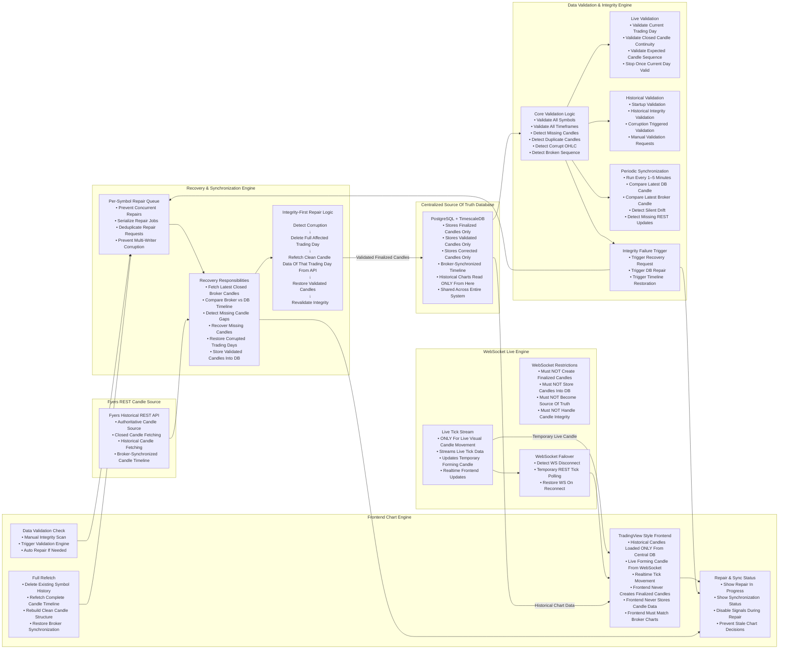

```mermaid
flowchart LR
 subgraph FRONTEND_ENGINE["Frontend Chart Engine"]
        FE["TradingView Style Frontend
    • Historical Candles Loaded ONLY From Central DB
    • Live Forming Candle From WebSocket
    • Realtime Tick Movement
    • Frontend Never Creates Finalized Candles
    • Frontend Never Stores Candle Data
    • Frontend Must Match Broker Charts"]
        UI_STATUS["Repair & Sync Status
    • Show Repair In Progress
    • Show Synchronization Status
    • Disable Signals During Repair
    • Prevent Stale Chart Decisions"]
        VALIDATE_BTN["Data Validation Check
    • Manual Integrity Scan
    • Trigger Validation Engine
    • Auto Repair If Needed"]
        REFETCH_BTN["Full Refetch
    • Delete Existing Symbol History
    • Refetch Complete Candle Timeline
    • Rebuild Clean Candle Structure
    • Restore Broker Synchronization"]
  end
 subgraph WS_ENGINE["WebSocket Live Engine"]
        WS["Live Tick Stream
    • ONLY For Live Visual Candle Movement
    • Streams Live Tick Data
    • Updates Temporary Forming Candle
    • Realtime Frontend Updates"]
        WS_RULES["WebSocket Restrictions
    • Must NOT Create Finalized Candles
    • Must NOT Store Candles Into DB
    • Must NOT Become Source Of Truth
    • Must NOT Handle Candle Integrity"]
        WS_FAILOVER["WebSocket Failover
    • Detect WS Disconnect
    • Temporary REST Tick Polling
    • Restore WS On Reconnect"]
  end
 subgraph FYERS_REST_ENGINE["Fyers REST Candle Source"]
        REST["Fyers Historical REST API
    • Authoritative Candle Source
    • Closed Candle Fetching
    • Historical Candle Fetching
    • Broker-Synchronized Candle Timeline"]
  end
 subgraph DB_ENGINE["Centralized Source Of Truth Database"]
        DB["PostgreSQL + TimescaleDB
    • Stores Finalized Candles Only
    • Stores Validated Candles Only
    • Stores Corrected Candles Only
    • Broker-Synchronized Timeline
    • Historical Charts Read ONLY From Here
    • Shared Across Entire System"]
  end
 subgraph VALIDATION_ENGINE["Data Validation & Integrity Engine"]
        VALIDATOR["Core Validation Logic
    • Validate All Symbols
    • Validate All Timeframes
    • Detect Missing Candles
    • Detect Duplicate Candles
    • Detect Corrupt OHLC
    • Detect Broken Sequence"]
        LIVE_VALIDATION["Live Validation
    • Validate Current Trading Day
    • Validate Closed Candle Continuity
    • Validate Expected Candle Sequence
    • Stop Once Current Day Valid"]
        HISTORICAL_VALIDATION["Historical Validation
    • Startup Validation
    • Historical Integrity Validation
    • Corruption Triggered Validation
    • Manual Validation Requests"]
        PERIODIC_SYNC["Periodic Synchronization
    • Run Every 1–5 Minutes
    • Compare Latest DB Candle
    • Compare Latest Broker Candle
    • Detect Silent Drift
    • Detect Missing REST Updates"]
        REPAIR_TRIGGER["Integrity Failure Trigger
    • Trigger Recovery Request
    • Trigger DB Repair
    • Trigger Timeline Restoration"]
  end
 subgraph RECOVERY_ENGINE["Recovery & Synchronization Engine"]
        RECOVERY["Recovery Responsibilities
    • Fetch Latest Closed Broker Candles
    • Compare Broker vs DB Timeline
    • Detect Missing Candle Gaps
    • Recover Missing Candles
    • Restore Corrupted Trading Days
    • Store Validated Candles Into DB"]
        REPAIR["Integrity-First Repair Logic

    Detect Corruption
    ↓
    Delete Full Affected Trading Day
    ↓
    Refetch Clean Candle Data Of That Trading Day From API
    ↓
    Restore Validated Candles
    ↓
    Revalidate Integrity"]
        MUTEX["Per-Symbol Repair Queue
    • Prevent Concurrent Repairs
    • Serialize Repair Jobs
    • Deduplicate Repair Requests
    • Prevent Multi-Writer Corruption"]
  end
    FE --> UI_STATUS
    WS -- Temporary Live Candle --> FE
    WS --> WS_FAILOVER
    WS_FAILOVER --> FE
    DB -- Historical Chart Data --> FE
    DB --> VALIDATOR
    VALIDATOR --> LIVE_VALIDATION & HISTORICAL_VALIDATION & PERIODIC_SYNC & REPAIR_TRIGGER
    REPAIR_TRIGGER --> MUTEX & UI_STATUS
    VALIDATE_BTN --> MUTEX
    REFETCH_BTN --> MUTEX
    MUTEX --> RECOVERY
    REST --> RECOVERY
    RECOVERY --> REPAIR & UI_STATUS
    REPAIR -- Validated Finalized Candles --> DB
```